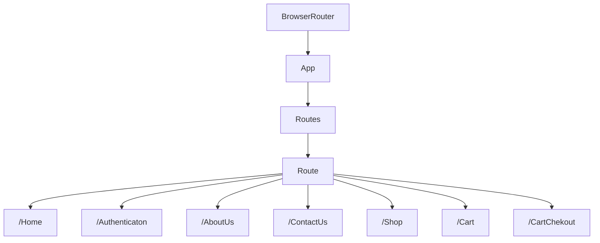
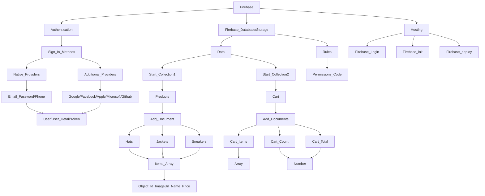

# crwn-app-intern-dhaneshwar
## React + TypeScript + Vite
This are the Step for Run this Project in your System
1. Clone or Fork this Repo
2. Run This Commands
## Netlify Local Run Command
```
npm install
netlify dev
```
## 🗒️ DOCUMENTAION | CHEATSHEET | LEARNING | SOLUTIONS
### 1. ALL .MD File Here on this Links
[🔗 TECHNICAL PAPERS OF LEARNING PATH 2](https://github.com/Dhaneshwar7/Technical-Paper/tree/main)

[🔗 Full All TOPICS CHEATSHEET IN ONE PLACE ](https://github.com/Dhaneshwar7/Technical-Paper/blob/main/README.md)
### 2. Go To Chetsheets Section TopicWise .MD File - Specific
| TOPICS | LINKS |
| --- | --- |
| React Router| [React Router CheatSheet](#1-react-router-cheatsheet)|
| Firebase| [Firebase CheatSheet](#2-firebase-cheatsheet)|
| React Context API | [React Context API CheatSheet](#3-react-context-api-cheatsheet)|
| React Flat Folder Structure | [React Flat Folder Structure CheatSheet](#4-react-flat-folder-structure-cheatsheet) |
| React Redux | [React Redux CheatSheet](#5-react-redux-cheatsheet)|
| Redux Persist | [Redux Persist CheatSheet](#6-redux-persist-cheatsheet)|
| Netlify | [Netlify CheatSheet](#7-netlify-cheatsheet)|
| Stripe with React.js | [Stripe with React.js CheatSheet](#8-stripe-payment-with-react-js-cheatsheet)|


# Technical-Paper
These are my Learning Notes of All Technologies in different .MD files

---
# 1. React Router Cheatsheet
<div align="center">
 	
</div>

## Some Reading Notes 

[Official Website React Router 🔗](https://reactrouter.com/en/main)

### React Router 
React Router is a collection of navigational components within your application. With the latest version, React Router v6, there are several new features and improvements over the previous versions. This article will help you understand how to use React Router in a modern React application.

# Where i was Stuck & Solution(R&D) & Learning

>[!NOTE]
>        - Browser Router Structure
`This is /main.tsx`
```js
import { BrowserRouter } from 'react-router-dom';

<BrowserRouter>
     <App />
</BrowserRouter>
```
`This is App.tsx`
```js
import { Route, Routes } from 'react-router-dom';
<Routes>
        <Route path="/" element={<MainLayout />}>
            <Route index element={<HomePage />} />
            <Route path="/shop/*" element={<ShopLayout />}>
                <Route path="all-products" element={<AllProducts />} />
                <Route path=":categoryName" element={<CategoryPreview />} />
            </Route>
            <Route path="/shop/cart-checkout" element={<CartCheckoutPage />} />
            <Route path="/authentication" element={<AuthenticationPage />} />
        </Route>
</Routes>
```

## 𖦋 -> React Router Structure Diagram:-

This is React Router \*For Learning Purpose i created\* 

## 𖦋 -> Basic Components and Hooks of React Router Which i Used in Task :-

####      * `<Link>`: - A <Link> is an element that lets the user navigate to another page by clicking or tapping on it. In react-router-dom.
####      * `<NavLink>`: - A <NavLink> is a special kind of <Link> that knows whether or not it is "active", "pending", or "transitioning". 
####      * `<Outlet>`: - An <Outlet> should be used in parent route elements to render their child route elements. This allows nested UI to show up when child routes are rendered. If the parent route matched exactly, it will render a child index route or nothing if there is no index route.
####      * `<useNavigate>`: - The useNavigate hook returns a function that lets you navigate programmatically, for example in an effect:
```js
import { Link ,NavLink ,Outlet,useNavigate} from "react-router-dom";
const navLinks=[{id:1,link:'/home'},{id:2,link:'/about'},{id:3,link:'/contactus'},{id:4,link:'/auth'}]
function NavigationBar() {
const navigate = useNavigate();
const hancleGoogleSignIn = async () => {
     try {
          const { user } = await asyncSignInWithGoogle();
			if (user) {
				await asyncCurrentLoggedInUser();
				navigate('/');
			}} catch (error) {console.error(error)}};
  return ( <>
          <span>Logo</span>
          <ul> {navLinks.map(nav => (
                    <li key={nav.id}>
                         <Link to={`/${nav.link}`}>{nav?.link.toUpperCase()}</Link>
                    </li>))}
	 </ul>
	<NavLink to="/messages"  className={({ isActive, isPending }) => isPending ? "pending" : isActive ? "active" : ""}>
		Messages
	</NavLink>;
    </>)};

function MainLayout() {
  return (<>
     <Header/>
      <Outlet />
     <Footer/> </>
  )};
function App() {
  return (
    <Routes>
      	<Route path="/" element={<MainLayout />}>
        	<Route index element={<HomePage />}/>
        	<Route path="aboutus" element={<AboutUs />} />
        	<Route path="contactus" element={<ContactUs />} />
		...etc
      	</Route>
    </Routes>)};

```
---
# 2. Firebase CheatSheet
<div align="center">
 	
</div>

# Firebase Technical Paper
## Some Reading Notes 
### Authentication:-
Firebase Authentication provides backend services to help authenticate users in your app. It supports various authentication methods, including email/password and OAuth providers like Google and Facebook.
### Firestore:-
Firestore is a flexible, scalable database for mobile, web, and server development. It provides real-time synchronization and offline support, making it easy to build responsive applications.
### Storage:-
Firebase Storage provides secure file uploads and downloads for Firebase apps. It is designed to scale from petabytes to exabytes, and to handle high-frequency use cases like streaming and uploading media.
### Firebase Hosting:-
is a fully-managed hosting service for static and dynamic content as well as microservices. It provides fast and secure hosting with features such as SSL, custom domains, and auto-scaling.
# Where i was Stuck & Solution(R&D) & Learning
>[!WARNING]
>        - In Firebase CRUD OPERATIONS Access Change Rules Section.

>[!NOTE]
> Like This way Manipulate Operations. 
```js
rules_version = '2';
service cloud.firestore {
  match /databases/{database}/documents {
    match /{document=**} {
    allow create: if request.auth !=null && request.auth.uid == request.resource.data.userId;
    allow update,delete :  if request.auth != null ;
    allow read: if true;
    }
  }
}
```
>[!TIP]
> Reading Documentation And Took help of ChatGPT to undestand more
[Firebase Rules Documentaion](https://firebase.google.com/docs/firestore/security/get-started?hl=en&authuser=0)
&nbsp; [Structure Data in Firestore](https://firebase.google.com/docs/firestore/manage-data/structure-data?hl=en&authuser=0)
# 𖦋 -> Firebase Structure Diagram:-
This is Firebase Structure \*For Learning Purpose i created\* 

# 1️⃣-> Authentication Firebase Setup with Firestore Database
#### Setup Code Provided from Firebase after Creating Project/App
`./firebase.ts`
```js
import { initializeApp } from 'firebase/app';
import { getAuth, GoogleAuthProvider } from 'firebase/auth';
import { getFirestore } from 'firebase/firestore';
const firebaseConfig = {
	...config code
};
const app = initializeApp(firebaseConfig);
export const auth = getAuth(app);
export const googleProvider = new GoogleAuthProvider();
export const db = getFirestore(app);
```
## Authentication Actions
### Imports ⇣
`./FirebaseAuthActions.ts`
```js
import { createUserWithEmailAndPassword,onAuthStateChanged,signInWithEmailAndPassword,signInWithPopup,signOut} from 'firebase/auth';
import { auth, googleProvider } from './Firebase';
```
### * SignInWithGoogle
```js
export const asyncSignInWithGoogle = async () => {
	return await signInWithPopup(auth, googleProvider);
};
const hancleGoogleSignIn = async () => {
		try {
			const { user } = await asyncSignInWithGoogle();
			if (user) {
				setCurrentUser(user);
				navigate('/');
			}
		} catch (error) {console.error(error)}};
//THIS IS UI
<Button onClick={hancleGoogleSignIn}> Continue with Google </Button>
```
### * createUserWithEmailAndPassword 
> This take a <b> Auth, Email, Password </b> as Parameters and Create new Account of User in FireStore
```js
export const asyncCreateUserWithEmailAndPassword = async (email: string, password: string) => {
	return await createUserWithEmailAndPassword(auth, email, password);
};
```
### * SignInUserWithEmailAndPassword
> This also takes a <b> Auth, Email, Password </b> as Parameters and Sign In Successful !!
```js
export const asyncSignInUserWithEmailAndPassword = async (email: string,password: string) => {
	return  signInWithEmailAndPassword(auth, email, password);
};
```
### * onAuthStateChanged || This method check for current User if Logged In Or Not 
> This is Firebase *onAuthStateChanged method for fetch Logged in user !!
```js
export const asyncCurrentLoggedInUser = () => {
	return new Promise((resolve, reject) => {
		onAuthStateChanged(auth,user => {
				if (user) { resolve(user);
				} else {resolve(null)};
			},reject
);});};
```
### * SignInUserWithEmailAndPassword
> This just take Auth as Parameter and  Signout --> Logged in User !!
```js
export const asyncLogOutUser = async () => {
	return await signOut(auth);
};
```
# 2️⃣-> Firestore Database
`/FirebaseBooksAction.ts`
```js
/*  -----------Books Actions--------- */
export const asynchandleBookFormSubmit = async bookData => {
	const allBooksCollection = collection(db, 'books');
	try {
		if (!bookData.bookName == '' || !bookData.publishDate == '') {
			return await addDoc(allBooksCollection, bookData);
		}
	} catch (error) {console.error(error)}
};

export const asyncGetBooksData = async () => {
	const allBooksCollection = collection(db, 'books');
	try {
		const data = await getDocs(allBooksCollection);
		return data.docs.map(doc => ({...doc.data(),id: doc.id,}));
	} catch (error) {console.error(error)}};

export const asyncHandleEditBook = async (bookId, editedBookName) => {
	try {
		const bookDoc = await doc(db, 'books', bookId);
		return await updateDoc(bookDoc, { title: editedBookName });
	} catch (error) {console.error(error)}};

export const asyncHandleDeleteBook = async bookId => {
	try {
		const bookDoc = doc(db, 'books', bookId);
		await deleteDoc(bookDoc);
	} catch (error) {console.error(error)}};

export const handleUploadFile = async () => {
	if (!uploadFile) return null;
	const fileFolderRef = ref(storage, `booksImages/${uploadFile.name}`);
	try {
		await uploadBytes(fileFolderRef, uploadFile);
	} catch (error) {console.error(error)}};
```
# 3️⃣-> Hosting
>Fire base also Provide Hosting Website/App
For that, After Completing Ourt Project we have to Execute :-
```js
npm run build
```
Which will Generate `dist` || `build` Folder for Deployement where our final `index.html` Presents
Then we have to Setup Hosting Project Procedure which will get from Firebase Hosting Tab ,
There need to some Action like --

`\* First Command for Setup your Firebase Email Id *\`

```js

firebase login
```
>[!NOTE]
> There Are the Commands helps if stuck in Login/CLI Setup
`With Firebase CLI you can have multiple accounts logged in.`

>Using firebase `login:add` will login another account.

>Using firebase `login:list` will list logged accounts.

>Using firebase `login:use` will set default account for current project directory.`
>And you can use `firebase logout` to logout from Firebase.
🔗 [Reference Link For Reading Login Setup in Terminal](https://stackoverflow.com/questions/75563709/how-could-i-change-my-firebase-login-account-to-another-account-and-login-again)
Next Command is 
```js
firebase init
```
Which will Come-Up with so Many Question like this ;- Proceed Accordigly-
```js
//Before firebase init make sure that run Build command like 
npm run build
//this after completion this will provide dist/build folder put that name in this line of code 
? What do you want to use as your public directory? Dist
? Configure as a single-page app (rewrite all urls to /index.html)? No
? Set up automatic builds and deploys with GitHub? Yes
✔  Wrote dist/404.html
? File dist/index.html already exists. Overwrite? No
? For which GitHub repository would you like to set up a GitHub workflow? (format: user/repository) Dhaneshwar7/Firebase-Learn
? Set up the workflow to run a build script before every deploy? No
? Set up automatic deployment to your site's live channel when a PR is merged? Yes
? What is the name of the GitHub branch associated with your site's live channel? Main
? The GitHub workflow file for deploying to the live channel already exists. Overwrite?
firebase-hosting-merge.yml No

Final command –  firebase deploy
Hosting URL: https://fir-learn-hk.web.app
```
Done Almost Afte That Last Step 📍
```js
firebase deploy
```
---
# 3. React Context API CheatSheet
<div align="center">
 	
</div>

## Some Reading Notes 
[Context API Documentation 🔗](https://legacy.reactjs.org/docs/context.html)
### React Context API 
React Router is a collection of navigational components within your application. With the latest version, React Router v6, there are several new features and improvements over the previous versions. This article will help you understand how to use React Router in a modern React application.

---
# 4. React Flat Folder Structure CheatSheet
<div align="center">
 	
</div>

>[!TIP]
> Some Documetation for Folder Structure

[Flat Folder Structure 🔗](https://github.com/lokesh903/react-starter-kit-flat-structure)

[Level wise Folder Structure as Project Difficulties 🔗](https://dev.to/itswillt/folder-structures-in-react-projects-3dp8#:~:text=Personally%2C%20I'd%20often%20recommend,intuitive%20architecture%20across%20React%20applications.)


---
 # 5. React Redux CheatSheet
 
<div align="center">
 	
</div>

## Some Reading Notes 
[React Redux Documentation 🔗]([https://github.com/lokesh903/react-starter-kit-flat-structure](https://react-redux.js.org/))
# React Redux
Redux solves the state transfer problem by storing all of the states in a single place called a store. So, managing and transferring states becomes easier as all the states are stored in the same convenient store. Every component in the application can then directly access the required state from that store
```
my-react-app/
├── public/
│   └── favicon.ico
├── src/        
│   ├── components/
│   ├── store/
│   │   ├──  store.ts 
│   │   ├──  actions/            
│   │   │    └── userAction.ts
│   │   │    └── productAction.ts             
│   │	├── reducers/
│   │   │    └── userReducer.ts               
│   │   │    └── productReducer.ts
│   ├── assets/
│   │   └── images/                  
│   ├── App.tsx                
├── .gitignore
```
---
# 6. Redux Persist CheatSheet
<div align="center" backgroundColor="white">
 	
</div>

## Some Reading Notes 
[Redux Persist Documentation 🔗](https://www.npmjs.com/package/redux-persist)
[React Redux YouTube 🕹️](https://www.youtube.com/watch?v=x30tfjNUF_8)
### Redux Persist 
#### 1. Why use Redux Persist?
Redux Persist is a state management tool that allows the state in a Redux store to persist across browser and app sessions, improving user experience by pre-loading the store with persistent data. It also offers robustness against unexpected crashes and network issues, preventing data loss and offering a more reliable user experience.
```js
import { PersistGate } from 'redux-persist/integration/react'
const { store, persistor } = configureStore();

ReactDOM.createRoot(document.getElementById('root')!).render(
  <React.StrictMode>
    <Provider store={store}>
      <PersistGate loading={null} persistor={persistor}>
        <App />
      </PersistGate>
    </Provider>
  </React.StrictMode>
)
```
#### 1. What does PersistGate do in this Code ?
If you are using react, wrap your root component with PersistGate. This delays the rendering of your app's UI until your persisted state has been retrieved and saved to redux. NOTE the PersistGate loading prop can be null, or any react instance, e.g. loading={<Loading />}
>[!CAUTION]
> I Was Writing code in TS and Stuck on this Error of createStore and Type of persistReducer.
`/store.ts`
```js
import { legacy_createStore as createStore } from 'redux'; <<---- So creatStore depricated and it now comes with legacy_createStore...
import { persistStore, persistReducer } from 'redux-persist';
import storage from 'redux-persist/lib/storage';
// import { composeWithDevTools } from 'redux-devtools-extension';

import rootReducer from './reducers';
const persistConfig = {
	key: 'root',
	storage,
	whitelist: ['user', 'cart', 'products'],
};

const persistedReducer = persistReducer<any, any>(persistConfig, rootReducer); <<---- and here <any, any> 
export default () => {
	let store = createStore(persistedReducer);
	let persistor = persistStore(store);
	return { store, persistor };
};
```
>[!TIP]
> This Resources helped me to resolve...
### I resolve this issue from reading this documentation
[creatStore Docs](https://redux.js.org/api/createstore)

[persistReducer Type Error Docs](https://github.com/rt2zz/redux-persist/issues/1184)

---
# 7. Netlify CheatSheet
<div align="center">
 	
</div>

## Some Reading Notes 
### Netlify
Netlify is a remote-first cloud computing company that offers a development platform that includes build, deploy, and serverless backend services for web applications and dynamic websites

### Serverless Functions of Netlify 
Netlify Serverless Functions allow you to run backend code without managing a server. These functions are hosted on Netlify's infrastructure, automatically scaled, and executed on-demand in response to HTTP requests. They are commonly used to handle tasks such as form submissions, API calls, or custom business logic in a serverless environment.
```js
// netlify/functions/hello.js

exports.handler = async function(event, context) {
  return {
    statusCode: 200,
    body: JSON.stringify({ message: 'Hello, world!' })
  };
};

```

---
# 8. Stripe Payment with React JS CheatSheet
<div align="center">
 	
</div>

>[!IMPORTANT]
> Some Documentation Stuff

[Stripe Youtube 🔗](https://www.youtube.com/watch?v=e-whXipfRvg&feature=youtu.be)
[Stripe Documentation 🔗](https://docs.stripe.com/stripe-js/react)

## Some Reading Notes 
###  Stripe 
Stripe's payments platform lets you accept credit cards, debit cards, and popular payment methods around the world—all with a single integration. Get access to advanced payments features like 3D Secure 2 authentication, card updates, automated retries, and more.
